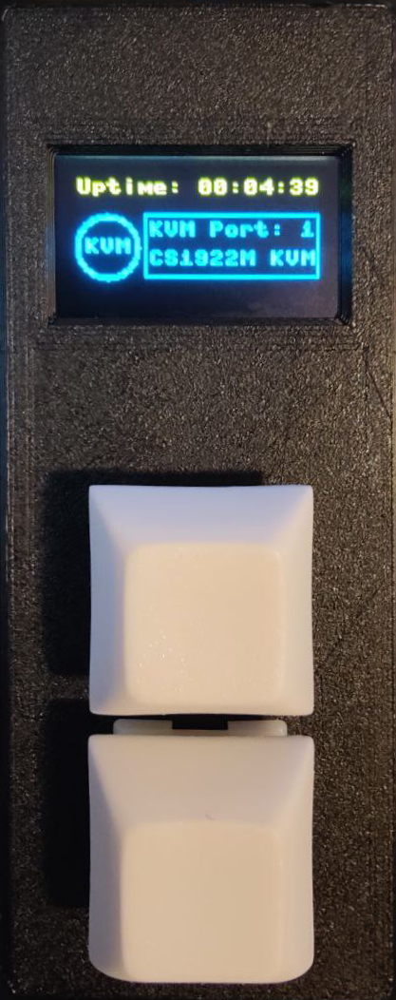

# CS1922M RJ11

Control Aten 1922M KVM over serial using Raspberry PI Pico

## Hardware

- Raspberry PI Pico
- Aten CS1922M KVM
- 3.3V TTL to RS232 adapter
- SSD1306 OLED display
- 2 buttons
- 1 cable to connect to KVM serial port (RJ10 male)

## Software

- [MicroPython](https://micropython.org/)

## Wiring

Here's how to connect the components:

### Raspberry PI Pico to SSD1306 OLED Display

- GPIO 2 (SDA) to SDA on the OLED display
- GPIO 3 (SCL) to SCL on the OLED display
- GND to GND on the OLED display
- VBUS (5V) to VCC on the OLED display

### Raspberry PI Pico to Buttons

- GPIO 0 to one leg of Button 1, and the other leg to GND
- GPIO 1 to one leg of Button 2, and the other leg to GND

### Raspberry PI Pico to 3.3V TTL to RS232 Adapter

- GPIO 4 (TX) to RX on the adapter
- GPIO 5 (RX) to TX on the adapter
- GND to GND on the adapter

### 3.3V TTL to RS232 Adapter to Aten CS1922M KVM

- Connect the RS232 port of the adapter to the RJ10 male cable, which then connects to the KVM serial port.

Please note that the GPIO numbers are based on the `machine.Pin` numbers used in the `main.py` script. Make sure to adjust these numbers if you've used different pins in your setup.
